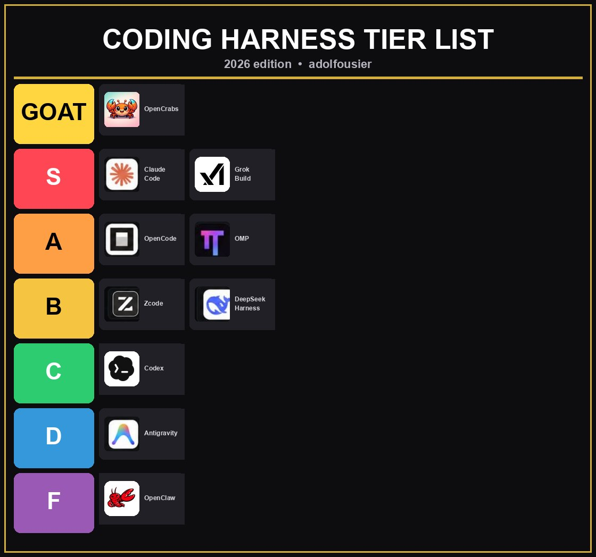

# harness-tier-template

Source of truth for the **Coding Harness Tier List** graphic (the one that
lives on X/community posts). Edit config + swap logos, run one command, get
the finished board. No design tools, no AI-image roulette.

## Layout



```
harness-tier-template/
├── config.json      <- tiers, order, names, colors (EDIT THIS)
├── compose.py       <- renders output/board.png from config + assets
├── check.py         <- pixel-verifies label spacing (the clipping gate)
├── assets/          <- one PNG per harness icon (any size, auto-fitted)
├── sources/         <- original photos the assets came from (provenance)
└── output/board.png <- the finished board (regenerated every run)
```

## The update drill

```bash
# 1. swap a logo: drop any PNG into assets/ (any size works, auto-fitted)
cp ~/Downloads/newgrok.png assets/grok.png

# 2. rename / move between tiers / re-rank: edit config.json
#    tiers are listed top to bottom, entries left to right (2 per row)

# 3. rebuild + verify
python3 compose.py && python3 check.py

# 4. output/board.png is the deliverable
```

`check.py` fails the run if any label overflows its card or breaks the
minimum right padding - the exact bug that shipped once because nobody
measured. Never skip it.

## Rules baked in

- Labels auto-fit: font shrinks 13 -> 9 until the text fits with 10px right
  padding. Long names never clip.
- Icons normalize to the 66x66 slot (contain-fit, centered).
- Geometry is measured from the approved board, constants live at the top of
  `compose.py`. Change the layout there, not by hand in an editor.

## Adding a harness

```json
{ "name": "NewThing", "logo": "newthing.png" }
```

Drop `newthing.png` in `assets/`, add the entry to the tier's `entries` array
in `config.json`. Max 2 entries per tier row.

## Requires

```bash
python3 -m pip install pillow
```
